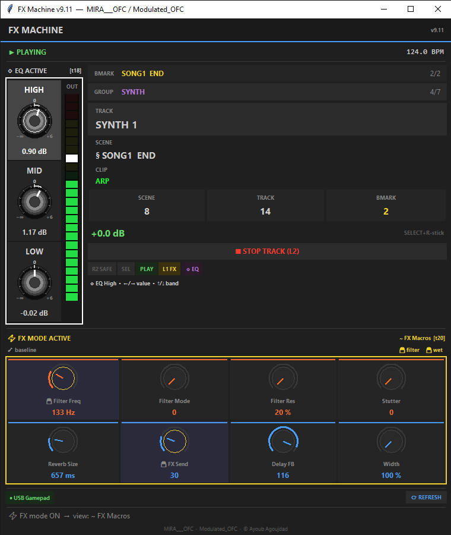
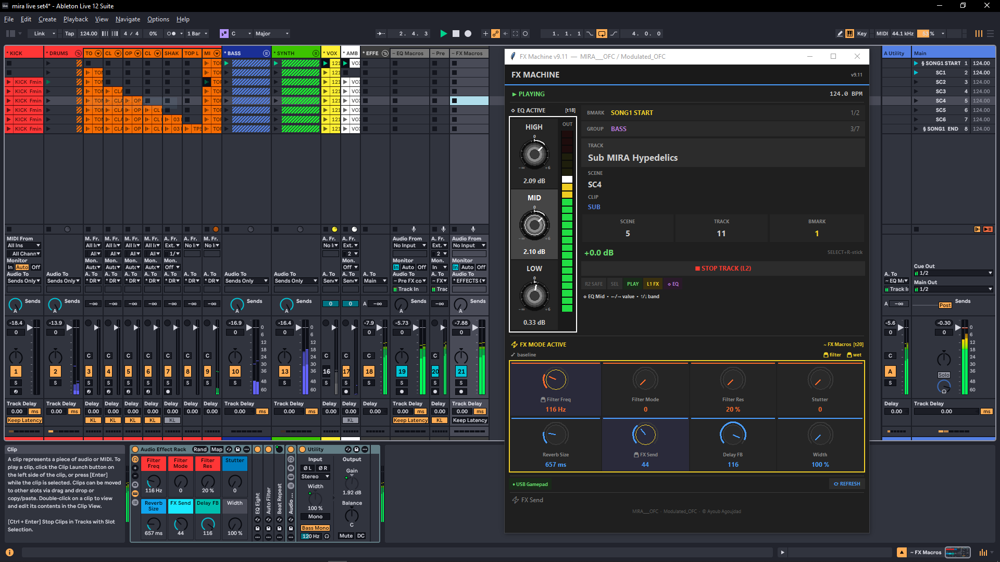

<div align="center">

# 🎛️ FX Machine

### A USB Gamepad Turned Into a Live Performance Instrument for Ableton Live



*Designed for melodic house & progressive deep house*

**v9.11** · Modeled after the Pioneer DJM-900 NXS2 channel strip topology

---

[](https://www.python.org)
[]()
[](https://www.ableton.com)
[](#license)

</div>

---

## 🎯 What Is This?

**FX Machine** transforms a generic USB gamepad into a precision instrument for live electronic music performance. It bridges a PlayStation-style controller to Ableton Live via OSC, exposing two parallel effect racks — a 3-band kill EQ and an 8-macro FX rack — that you can manipulate with **encoder-style sticks**, **double-flick gestures**, and **momentary button effects**.

This isn't a MIDI mapping. It's a custom-built performance system with its own gesture language, safety logic, visual feedback layer, and **hot-reloadable TOML config** so you can tune feel on the fly without restarting.

```
       Gamepad ──── USB ──── FX Machine ──── OSC ──── Ableton Live
                              (Python)              (AbletonOSC)
                                  │
                                  ▼
                          Real-time Tkinter UI
                          (knobs · meters · status)
```

---

## ✨ Key Features

### 🎚️ Dual-Rack Signal Chain (DJM-900 Style)

The system inserts two racks in series before your master output, exactly like a real DJ mixer channel strip:

```
All instrument tracks ──▶ Return A
                              │
                              ▼
                       ~ EQ Macros      (3-band kill EQ, shapes the source)
                              │
                              ▼
                       ~ FX Macros      (filter / reverb / delay / stutter)
                              │
                              ▼
                          Master
```

### 🎛️ EQ Engine — Encoder + Smart Gestures

Three bands (Low / Mid / High), each with **two gesture modes** on the right stick:

| Gesture | Action |
|---|---|
| **Stick X right (held)** | Encoder: boost current band, value HOLDS on release |
| **Stick X left (held)** | Encoder: cut current band, value HOLDS on release |
| **Stick Y up double-flick** | Switch to band above (wraps: MID → HIGH → LOW → MID) |
| **Stick Y down double-flick** | Switch to band below (wraps: MID → LOW → HIGH → MID) |
| **Stick X left double-flick** | Smart kill / normalize (see logic below) |
| **Stick X right double-flick** | Smart restore / boost (see logic below) |

#### Smart Kill/Normalize Logic (Double-flick LEFT)

```
if current_value > 0 dB:
    → normalize back to 0 dB
else (current_value ≤ 0 dB):
    if band is BASS:
        → KILL to -∞ dB
    else (MID or HIGH):
        → cut to -19 dB
```

#### Smart Restore/Boost Logic (Double-flick RIGHT)

```
if current_value < 0 dB:
    → restore to 0 dB
else (current_value ≥ 0 dB):
    if band is BASS:
        → 🚫 BLOCKED (speaker safety)
    else (MID or HIGH):
        → boost by 15% of remaining headroom (asymptotic)
```

### ⚡ FX Engine — 8 Macros, 5 Effects

| Slot | Macro | Effect | Range |
|---|---|---|---|
| 1 | Filter Freq | Auto Filter cutoff (logarithmic) | 20 Hz – 20 kHz |
| 2 | Filter Mode | Auto Filter type | 0 = HP, 1 = LP |
| 3 | Filter Res | Auto Filter resonance | 20% – 100% |
| 4 | Stutter | Beat Repeat on/off | 0 / max |
| 5 | Reverb Size | Dark Hall decay | 200ms – 60s |
| 6 | FX Send | Wet/dry crossfade (Utility-based) | 0% – 100% |
| 7 | Delay FB | Long Digi Delay feedback | 0% – 92% (capped) |
| 8 | Width | Stereo Utility width | 0% – 200% |

#### Momentary Buttons (FX Layer = hold L1)

| Button | Effect |
|---|---|
| **L1 + X** | 💥 STUTTER (jam to max while held) |
| **L1 + O** | 🔻 BASS CUT (HP filter @ 200 Hz while held, restores snapshot on release) |
| **L1 + □** | 🌫 FX SEND THROW (jam to max while held, restores snapshot on release) |
| **L1 + △** | ▶▶ Launch scene |

#### 🔀 Internal Wet/Dry Routing — The "Throw and Tail" Trick

The FX rack isn't a simple serial chain. It uses a **nested wet/dry rack** so that turning off the FX Send doesn't kill the reverb and delay tails — they ring out naturally, exactly like a real DJ mixer's send/return loop.

```
Audio Effect Rack (~ FX Macros)
│
├── Auto Filter           ← always on the main path (Filter Freq + Mode + Res)
├── Beat Repeat           ← always on the main path (Stutter macro)
│
├── ┌─[ Nested Wet/Dry Rack ]──────────────────────┐
│   │                                              │
│   ├── Chain "Dry"  ─────────▶ passes through     │
│   │   (empty — direct signal continues)          │
│   │                                              │
│   └── Chain "Wet"                                │
│       ├── Utility    ◀── FX Send macro (gain)   │
│       ├── Dark Hall  ◀── Reverb Size macro      │
│       └── Long Digi Delay ◀── Delay FB macro    │
│                                                  │
└── └──────────────────────────────────────────────┘
│
└── Utility               ← Width macro (stereo width)
```

##### Why This Matters

If FX Send were a simple "wet mix" knob in series with the reverb/delay, dropping it to 0 would **cut everything dry too**. That's not how a real DJ mixer works. On a Pioneer DJM-900, the send/return loop has two key properties:

1. **The dry signal always passes through**, regardless of send amount
2. **When you stop sending to the FX, the existing reverb/delay tails continue to decay naturally**

This design replicates both behaviors:

| FX Send macro value | Behavior |
|---|---|
| **100% (max)** | Full signal feeds into the wet chain → maximum reverb + delay |
| **50%** | Half signal feeds in → moderate wet tails |
| **0% (off)** | Nothing new enters the wet chain, BUT the **reverb decay continues** and the **delay buffer keeps feeding back** until they fade naturally |

##### The "Throw and Let It Tail" Technique

This routing is what enables the throw-and-tail move used in melodic house/techno:

```
1. Crank FX Send to max (L1+□ throw)        → big wet swell on the next 1-2 bars
2. Release the throw button                  → FX Send snaps back to 0
3. The dry signal continues clean            → but the tail keeps ringing
4. Reverb decays for 30+ seconds             → ambient atmosphere
5. Delay feedback continues bouncing         → rhythmic echoes
```

You can stack multiple throws to build up a wall of tails, then **kill the bass + drop a fresh element** — the tails carry the energy while the new sound establishes itself. Classic Ben Böhmer / Yotto / Nora En Pure move.

##### Inner vs Outer Chain Macro Assignment

| Macro | Path | Effect on signal |
|---|---|---|
| Filter Freq | Outer (main) | Affects everything — dry AND wet |
| Filter Mode | Outer (main) | Affects everything — dry AND wet |
| Filter Res | Outer (main) | Affects everything — dry AND wet |
| Stutter | Outer (main) | Affects everything — dry AND wet |
| **FX Send** | **Inner (gain into wet chain)** | **Controls how much new signal feeds the FX** |
| Reverb Size | Inner (wet chain) | Adjusts reverb decay time |
| Delay FB | Inner (wet chain) | Adjusts delay feedback amount |
| Width | Outer (final) | Stereo widening on the entire output |

This means **you can filter or stutter the wet tails** by sweeping Filter Freq or hitting STUTTER — the outer effects process the combined dry+wet output. Powerful for transitions where you sweep down the cutoff while letting reverb tails ring through, then re-open the filter on the drop.

##### Recovery Behavior on L1 Release

When you release L1 (exit FX mode), the recovery system honors this routing:

- **Filter Freq** → restored to baseline (unless filter-locked via L1+L3)
- **FX Send** → snapped to 0 (unless wet-locked via L1+R3)
- **Stutter** → snapped to 0 always
- **Reverb Size, Delay FB** → left untouched (the tails keep their character)

So a typical performance flow is:

1. Hold L1 (enter FX mode, view jumps to ~ FX Macros)
2. Sweep filter down, push FX Send to 50%, push Delay FB to 70%
3. Release L1 → Filter snaps back to neutral, FX Send drops to 0, **but the wet tails keep ringing with the delay rhythm you set**
4. The track is now back to dry with ambient washing over it

This is why **lock states matter** — if you want to keep FX Send at 50% across releases (for a wet bath effect), toggle wet-lock with L1+R3 before releasing L1.

### 📊 DJM-Style Channel Meter

A 24-segment vertical LED meter beside the EQ stack shows **real-time audio output level** from the EQ track, with:

- Green zone (0 – 0 dB)
- Yellow zone (0 – +3 dB)
- Red zone (+3 – +6 dB)
- **Peak hold** indicator (1.5s hold, then decay)
- Live data from Ableton via `output_meter_left/right` listeners

### 🎮 Controller Layers

| Layer | Trigger | Behavior |
|---|---|---|
| **Navigation** | Default | L-stick = track/scene, D-pad = bookmarks/groups |
| **FX Mode** | Hold L1 | Both sticks control FX macros, view follows |
| **EQ Mode** | Tap R3 | Right stick = EQ encoder + gestures |
| **Volume** | Hold SELECT | Right stick Y = track volume |

---

## 📸 Gallery

### Default / Navigation Mode

<div align="center">


</div>

Two-column layout: vertical EQ stack with DJM-900 style channel meter on the left, session navigation info on the right (bookmarks, groups, track / scene / clip names, position counters, volume display, modifier pills). FX panel spans the full width below.

The interface is built with Tkinter and rendered at 40 Hz. Knob bodies use canvas-drawn metallic gradients with white indicator lines, dB tick labels around the perimeter, and subtle glow rings to indicate selected/armed states.

### EQ Mode Active

<div align="center">



</div>

When EQ mode is toggled on (R3 in nav layer), the selected band glows white and the status bar shows the active controls. The right stick becomes an encoder for value control on the X axis, with double-flick gestures for band switching (Y) and smart kill / normalize / boost actions (X). The real-time audio output meter responds to the EQ track's actual signal level via OSC listeners on Ableton's `output_meter_left/right`.

---

## 🧮 The Math Behind the Feel

### Why the Encoder Isn't Linear

A real DJ wants **fine control near zero** and **fast sweeps at the edges**. So the encoder uses a curved velocity function:

```python
delta = (macro_range / sweep_seconds) × (stick_deflection ^ curve_exp)
```

Where:
- `sweep_seconds = 0.3` — time to sweep the full range at full deflection
- `curve_exp = 1.0` — pure linear response (proportional to stick position)

Tuning these values changes the feel dramatically. A higher `curve_exp` (1.3+) adds easing near rest (precise tweaks), while `1.0` gives instant proportional response (aggressive, performer-friendly). All values are hot-reloadable via the TOML config — see [Configuration](#️-configuration) below.

### Why 0 dB Isn't in the Middle of the Macro Range

Ableton's EQ Three uses a **logarithmic gain scale**: -∞ to 0 dB on the cut side, 0 to +6 dB on the boost side. The cut side has infinite range; the boost side only 6 dB. So in macro space (0–127), neutral 0 dB lives at **macro value 107.9**, not 64.

If we used a linear mapping (stick center → macro 64 → -13.8 dB), the EQ would feel completely wrong. Instead, the system uses **empirical calibration**:

| Macro Value | dB Output |
|---:|---:|
| 0 | -∞ (full kill) |
| 32 | -28.6 dB |
| 64 | -13.8 dB |
| 96 | -3.76 dB |
| **107.9** | **0 dB (neutral)** |
| 114 | +2 dB (bass safety cap) |
| 127 | +6 dB (max) |

The encoder works in **macro units per second**, not stick-position-to-dB mapping. This makes the response feel symmetric even though the underlying curve isn't.

### Sticky 0 dB Detent

When the encoder is **near neutral** (within ±1 macro unit of 0 dB), it slows down to 30% speed. This mimics the tactile detent on real EQ knobs at noon, making it easy to "find" 0 dB without overshooting — without becoming a wall that fights against intentional sweeps.

```python
distance = abs(current_value - 107.9)
if distance < 1.0:
    detent_factor = max(0.30, distance / 1.0)
    delta *= detent_factor
```

### Double-Flick Gesture Detection

A double-flick is a state machine:

```
       extreme         center         extreme
  idle ────────▶ flicked ─────▶ returned ─────▶ confirmed
  ◀───────── timeout (380ms) ─────────────────▶ reset
```

- **EQ_FLICK_EXTREME = 0.90** — stick must reach 90% deflection to count as "flicked"
- **EQ_FLICK_RETURN = 0.22** — must drop below 22% to count as "returned"
- **EQ_FLICK_TIMEOUT_MS = 380** — second flick must arrive within 380ms

Same direction required for second flick. Different direction or timeout → silent reset.

### Cubic Ease-Out Ramps

When a gesture triggers an action (e.g., kill bass), the system animates the macro change over 30–100ms using a **cubic ease-out** curve:

```python
progress = elapsed / duration            # 0.0 → 1.0
eased = 1.0 - (1.0 - progress) ** 3      # cubic ease-out
current_value = start + (target - start) * eased
```

Why cubic ease-out: linear ramps sound abrupt at the end. Exponential ramps (`1 - e^-3x`) sound too slow at the start. Cubic ease-out is musically natural and click-free.

### Axis Dominance Suppression (Mutual Exclusion)

The right stick is one physical input controlling two logical things (X = value, Y = band switch). To prevent accidental cross-axis triggers when diagonal motion happens, both axes use **strict mutual exclusion**:

```python
# Y dominance check
if abs(y) > abs(x) * 3.0:
    # Y dominates → suppress X completely, reset X gesture state
    return

# X gesture freezes Y while in progress
if x_in_gesture:
    reset_y_gesture_state()
    return
```

If Y is more than 3× larger than X, Y wins entirely. Conversely, once an X gesture has started (extreme deflection detected), Y is frozen until the X gesture either completes or times out. This bidirectional protection prevents diagonal flicks from firing both a band switch AND a value action by accident.

---

## ⚙️ Configuration

FX Machine ships with a powerful TOML-based configuration system that lets you tune every aspect of the controller's feel **without editing any code**. Changes can be applied while the app is running — no restart required for most settings.

### Where Config Lives

```
config/
├── default.toml           Factory template (do not edit — your safety net)
├── active.toml            Your current settings (this is what the app reads)
├── EXAMPLES.toml          Ready-to-copy preset snippets
├── README.md              Explainer for the folder
└── presets/               Your saved profiles
```

On first launch, the app automatically creates `active.toml` by copying `default.toml`. You edit `active.toml` going forward.

### How to Tune

1. Open `config/active.toml` in any text editor (Notepad++, VS Code, etc.)
2. Read the comments — every value is explained in plain English with recommended ranges
3. Change a number and save
4. In the FX Machine app, press **`SELECT + START`** on your controller (or click the **`⟳ REFRESH`** button)
5. Your changes apply instantly

If you write invalid TOML, the app warns you on reload and **keeps the previous working values** — your show is never broken.

### Hot-Reloadable vs Restart-Required

Most values reload instantly (marked `[LIVE]` in the comments). A few system-level settings need a full app restart (marked `[RESTART]`):

- UI refresh rate
- Window size
- OSC network ports
- EQ ramp animation tick rate

When you reload and a `[RESTART]` value has changed, the app tells you in the status bar:
```
🔄 ✓ Config reload — 0 applied, ⚠ 1 need restart
```

### Tunable Categories

The TOML file is organized into logical sections, each controlling a feature area:

| Section | Controls |
|---|---|
| `[eq.encoder]` | EQ stick sweep speed, curve shape, smoothing, deadzone |
| `[eq.dominance]` | How decisive Y vs X must be in EQ mode |
| `[eq.flick]` | Double-flick gesture timing thresholds |
| `[eq.detent]` | Sticky 0 dB feel near unity |
| `[eq.osc]` | OSC message throttling for EQ |
| `[eq.ramp]` | Animation duration for kill/normalize/boost actions |
| `[eq.safety]` | Bass boost cap, boost percentage per flick |
| `[trim]` | TRIM knob feel (sweep, curve, max gain) — Build B |
| `[meter]` | Channel meter reference offset, ballistics, peak hold |
| `[meter.clip]` | CLIP indicator thresholds and flicker behavior — Build B |
| `[fx]` | Per-macro sweep speeds, deadzone, acceleration |
| `[fx.delay_fb]` | Delay feedback discrete-stepping behavior |
| `[volume]` | SELECT+R-stick volume control sensitivity |
| `[navigation]` | Track/scene scrolling responsiveness |
| `[timing]` | Internal timing for polling, watchdog, debouncing |
| `[ui]` | UI refresh rate, window geometry (restart required) |
| `[network]` | OSC host and ports (restart required) |

### Ready-Made Presets

Five preset snippets ship in `config/EXAMPLES.toml`:

- **PUNCHY CLUB** — aggressive, fast, decisive (for live drops)
- **STUDIO PRECISE** — slow, surgical, fine-grained (for mixing)
- **BEGINNER FORGIVING** — easy controls, hard to make mistakes
- **RADIO/STREAM SAFE** — strict gain control, paranoid metering
- **VINTAGE ANALOG FEEL** — slow, springy, mechanical detent

To use a preset, copy the relevant TOML sections from `EXAMPLES.toml` into your `active.toml`, save, and reload. Mix and match — encoder settings from one preset, meter settings from another, etc.

### Saving Your Own Presets

Once `active.toml` feels great:

1. Copy `active.toml` to `presets/` and rename (e.g., `presets/my_club_set.toml`)
2. To recall later: copy any preset back to `active.toml` and reload

Send `.toml` files to other producers to share your tuning — they drop them in their `config/` folder and they get your exact feel.

### Resetting to Defaults

If you ever want a fresh start:

```bash
# Windows
del config\active.toml
python run.py
```

The app recreates `active.toml` from `default.toml` automatically.

### Example: Tuning the EQ Encoder

Edit `config/active.toml`:

```toml
[eq.encoder]

# Time in seconds to sweep across the FULL EQ range at maximum stick push.
# Lower = faster/aggressive, Higher = slower/precise
# Try: 0.20 (very fast) | 0.30 (default) | 0.50 (balanced) | 1.00 (surgical)
sweep_seconds = 0.30

# 1.0 = pure linear | 1.2 = slight ease at start | 2.0 = quadratic
curve_exp = 1.0

# 0.30 = heavily smoothed (laggy but stable)
# 0.55 = balanced (default)
# 1.00 = raw input (can feel twitchy)
smoothing_factor = 0.55

# How far stick must move before any change registers.
dead_zone = 0.18
```

Save, press `SELECT + START` in the app, immediately feel the change. No code editing, no restart, no compilation.

---

## 🏗️ Architecture

A modular Python application with **5 concurrent daemon threads** coordinated through a thread-safe shared state:

```
┌─ Main Thread ─────────────────────────────────┐
│  Tkinter UI (40 Hz update)                    │
│   ├─ build_ui() / update_ui()                 │
│   └─ Canvas-based knob & meter rendering      │
└───────────────────────────────────────────────┘
        ▲                              ▲
        │ reads state                  │
        │                              │
┌─ Controller Thread (~125 Hz) ────────┐
│  pygame events → handlers            │
│  axis handlers (smooth + curve)      │
│  → eq_drive_continuous_encoder()     │
│  → fx_drive_macro()                  │
└──────────────────────────────────────┘
        │ OSC out
        ▼
┌─ Ableton Live (via AbletonOSC) ──────┐
│   FX rack + EQ rack                  │
│   Audio output meters                │
└──────────────────────────────────────┘
        │ OSC in (listeners)
        ▼
┌─ OSC Server Thread ──────────────────┐
│  Routes by track_id / device_id      │
│  Updates shared state                │
└──────────────────────────────────────┘

┌─ Polling Thread (~6.6 Hz) ───────────┐
│  Periodic queries + safety polls     │
└──────────────────────────────────────┘

┌─ Watchdog Thread (1 Hz) ─────────────┐
│  Controller health + auto-reprobe    │
│  Ghost-event reconciliation          │
└──────────────────────────────────────┘

┌─ EQ Ramp Thread (60 Hz) ─────────────┐
│  Smooth value transitions            │
└──────────────────────────────────────┘
```

### Project Structure

```
fxmachine/
├── run.py                      Entry point: python run.py
├── build.py                    PyInstaller .exe builder
├── diagnose.py                 145+ automated health checks
├── README.md                   This file
├── .gitignore
├── config/
│   ├── default.toml            Factory template (don't edit)
│   ├── active.toml             User settings (edit this)
│   ├── EXAMPLES.toml           Preset snippets
│   ├── README.md               Config folder explainer
│   └── presets/                Saved user profiles
├── docs/
│   └── screenshots/            UI screenshots embedded in README
├── logs/
│   └── fxmachine.log           Rotating log file (auto-created)
└── src/
    ├── config.py               Architectural constants (don't change at runtime)
    ├── config_loader.py        TOML loader + cfg singleton + hot-reload
    ├── state.py                Shared state + thread locks
    ├── helpers.py              Math, formatting, smoothing
    ├── log_setup.py            Centralized logging system
    ├── main.py                 App entry: spawns 5 threads + Tkinter
    │
    ├── osc/
    │   ├── client.py           Outbound OSC (all osc_* send functions)
    │   ├── server.py           Inbound OSC (all on_* handlers + dispatcher)
    │   └── discovery.py        Session scanning + rack detection
    │
    ├── engine/
    │   ├── navigation.py       Scene/track/bookmark/group movement
    │   ├── actions.py          Discrete button actions
    │   ├── momentary.py        Stutter / bass cut / FX throw
    │   ├── eq.py               EQ gestures, encoder, smart actions
    │   ├── fx.py               FX macro stick driver + Delay FB stepping
    │   └── polling.py          Background polling + 60Hz EQ ramp thread
    │
    ├── controller/
    │   ├── watchdog.py         Auto-detect, reprobe, ghost-event fix
    │   ├── buttons.py          Layer-aware button routing
    │   ├── axes.py             Stick + D-pad handlers
    │   └── loop.py             Main controller thread (125 Hz)
    │
    └── ui/
        ├── palette.py          Colors + typography
        ├── widgets.py          Canvas renderers (knob, meter, label cache)
        ├── builder.py          Tkinter UI construction
        └── updater.py          UI update loop (40 Hz)
```

---

## 🚀 Quick Start

### Option A: Run from Python Source

**Requirements:**
- Windows 10 / 11
- Python 3.12+ (3.11+ minimum for `tomllib`)
- USB gamepad (PlayStation-style: 12 buttons, 2 analog sticks, D-pad)

```bash
# Install dependencies
pip install pygame python-osc

# Run
python run.py
```

On first launch, the app creates `config/active.toml` automatically from `config/default.toml`.

### Option B: Run the Standalone .exe

No Python needed on the target machine. Just download/build the `.exe`:

```bash
# One-time build setup
pip install pyinstaller

# Build the .exe
python build.py
```

The executable is created at `dist/FX_Machine.exe`. Double-click to run.

The .exe is self-contained — TOML config, logs, and presets are created in `dist/config/`, `dist/logs/`, etc. next to the .exe.

### Verify Setup

Before your first session, run the diagnostic tool:

```bash
python diagnose.py
```

It runs 145+ health checks and reports any issues with your installation, dependencies, project structure, or Ableton connection.

---

## 🎚️ Ableton Setup

Your Ableton session needs:

### 1. AbletonOSC Installed

Install [AbletonOSC](https://github.com/ideoforms/AbletonOSC) in Ableton's `Remote Scripts` folder. Default ports `11000` (recv) / `11001` (send) — matches FX Machine defaults.

### 2. Two Specifically-Named Tracks

**`~ FX Macros`** — An audio track or Return track containing an Audio Effect Rack with these 8 macros (names must match exactly):

- `Filter Freq` → Auto Filter frequency
- `Filter Mode` → Auto Filter type (HP/LP)
- `Filter Res` → Auto Filter resonance
- `Stutter` → Beat Repeat on/off
- `Reverb Size` → Dark Hall decay time
- `FX Send` → Utility inside a nested wet/dry rack (controls wet chain gain)
- `Delay FB` → Long Digi Delay feedback
- `Width` → Utility stereo width

The internal structure of this rack must follow the nested wet/dry topology described in the [Internal Wet/Dry Routing](#-internal-wetdry-routing--the-throw-and-tail-trick) section above. The dry chain must be empty (passthrough), and the wet chain contains the Utility (FX Send gain) → Dark Hall → Long Digi Delay in series.

**`~ EQ Macros`** — An audio track or Return track containing an Audio Effect Rack with these 3 macros mapped to an EQ Three device:

- `EQ Low` → GainLow
- `EQ Mid` → GainMid
- `EQ High` → GainHi

### 3. Optional Prefix Conventions

- Scenes prefixed with **`§`** become bookmarks (jump targets via D-pad)
- Tracks prefixed with **`*`** become group lead tracks (group navigation via D-pad)

---

## 🎮 Full Controller Map

### Navigation Layer (Default)

| Input | Action |
|---|---|
| L-stick Y | Scene navigation (hold to auto-scroll) |
| L-stick X | Track navigation |
| D-pad ↑ / ↓ | Bookmark prev/next |
| D-pad ← / → | Group prev/next |
| ✕ | Launch clip |
| ○ | Stop clip |
| △ | Launch scene |
| □ | Arm track |
| L2 | Stop track |
| R2 (hold) | Safety gate (prevents accidental launches) |
| START | Play/stop transport |
| R3 | Toggle EQ mode |

### FX Mode Layer (Hold L1)

| Input | Action |
|---|---|
| L-stick Y | Filter Freq (with acceleration) |
| L-stick X | Filter Res |
| R-stick | FX Send + Reverb Size |
| D-pad ↑ / ↓ | Bookmark prev/next |
| D-pad ← / → | Delay FB step (1/20 of range) |
| L1 + ✕ | 💥 STUTTER (momentary) |
| L1 + ○ | 🔻 BASS CUT (momentary, snapshot restore) |
| L1 + △ | Launch scene |
| L1 + □ | 🌫 FX SEND THROW (momentary, snapshot restore) |
| L1 + L3 | Toggle filter lock |
| L1 + R3 | Toggle wet lock |

### EQ Mode Layer (Tap R3 to enter, R3 again to exit)

| Input | Action |
|---|---|
| R-stick X (hold) | Encoder: boost (right) / cut (left) — value HOLDS on release |
| R-stick Y ↑↑ | Switch band up (MID → HIGH → LOW, no borders) |
| R-stick Y ↓↓ | Switch band down (MID → LOW → HIGH, no borders) |
| R-stick X ←← | Smart kill / normalize |
| R-stick X →→ | Smart restore / boost (bass blocked at ≥ 0 dB) |

### Modifier Combos (SELECT held)

| Input | Action |
|---|---|
| SELECT + R-stick Y | Track volume control |
| SELECT + R3 | Volume mute toggle (single = unity, double = mute) |
| SELECT + R1 | Save FX baseline |
| SELECT + START | Force full refresh (TOML config + Ableton + controller) |

---

## 🔒 Safety Features

This system is built for **live performance**, where errors are unacceptable. Several safety mechanisms are baked in:

- **Bass boost cap** — encoder cannot push bass above +2 dB
- **Bass double-flick boost blocked** — protects subs and listeners
- **Delay feedback cap** — limited to 92% to prevent runaway feedback
- **R2 safety gate** — prevents accidental clip/scene launches when held
- **Lock states** — Filter and Wet can be locked to prevent FX recovery from changing them
- **FX baseline snapshot** — auto-captures startup values, restorable any time
- **Pre-engage snapshots** — momentary effects restore exactly what was there before press
- **Ghost-event reconciliation** — auto-recovers from dropped SELECT button release events
- **Controller auto-reprobe** — detects silent disconnects within 5 seconds and reconnects
- **Throttled OSC writes** — prevents Ableton flooding (25ms FX / 15ms EQ minimums)
- **Epsilon culling** — skips writes when the value change would be imperceptible
- **TOML reload protection** — broken config files keep previous working values, no crash

---

## 🪵 Logging

FX Machine writes a rotating log file with timestamps to:

- `logs/fxmachine.log` (when run from Python source)
- `[exe_folder]/logs/fxmachine.log` (when run from `.exe`)

Configuration:
- **5 MB per file**
- **10 rotated backups** (~55 MB total history)
- **INFO level by default** (DEBUG available for deep diagnostics)
- **Mirrors to console** during development
- **Per-module loggers** for clean filtering
- **Crash handler** logs uncaught exceptions before death
- **Session start/end banners** for easy log navigation

Example output:
```
22:47:13.124 [INFO ] fxmachine.osc.client            : OSC sender ready → 127.0.0.1:11000
22:47:13.890 [INFO ] fxmachine.controller.watchdog   : Controller FOUND: DragonRise Inc.
22:47:14.501 [INFO ] fxmachine.osc.discovery         : FX track found at index 12
22:47:14.602 [INFO ] fxmachine.osc.discovery         : EQ track found at index 13
22:47:15.001 [INFO ] fxmachine.engine.eq             : EQ band switched to High
22:47:15.345 [WARN ] fxmachine.controller.watchdog   : SELECT ghost release detected — force-cleared
22:48:01.789 [INFO ] fxmachine.config_loader         : Reload: EQ_SWEEP_SECONDS 0.3 → 0.5  [applied]
```

---

## 🛠️ Development

### Tech Stack

- **Python 3.12** — language
- **pygame 2.6** — gamepad input
- **python-osc** — OSC communication
- **tkinter** — UI (standard library, no extra install)
- **tomllib** — TOML parsing (Python 3.11+ built-in)
- **PyInstaller** — `.exe` builder
- **Git** — version control

### Project Health Tool

A diagnostic script runs 145+ automated health checks on the entire codebase:

```bash
python diagnose.py            # full check
python diagnose.py --quick    # skip slow tests (OSC, gamepad, git)
python diagnose.py --verbose  # show every check, not just failures
```

It validates:

- Python version and dependencies
- Project file structure
- Syntax across every `.py` file
- All module imports resolve
- TOML config validity and key mappings
- `cfg` singleton attribute coverage (catches broken `cfg.X` references at static-analysis time before runtime crashes)
- Log folder writability
- Dead/unused imports
- OSC port availability
- Gamepad detection and capability
- Git status

Run it before every commit and before every show. Exit codes: `0` = clean, `1` = warnings only, `2` = errors found.

### Architectural Constants vs Tunables

The codebase distinguishes two kinds of constants:

- **Architectural constants** (`src/config.py`) — facts about the system that never change at runtime. Button index numbers, OSC paths, the EQ neutral macro value calibrated empirically. These stay hardcoded.

- **Tunable values** (`config/active.toml` via `src/config_loader.py`) — preferences that affect feel. Sweep speeds, deadzones, gesture timings. These are loaded from TOML and hot-reloadable.

When adding new features, decide which category each new value belongs to. The `cfg` singleton makes the distinction explicit:

```python
from src.config import EQ_NEUTRAL_MACRO       # architectural — direct import
from src.config_loader import cfg

# Usage:
if value > EQ_NEUTRAL_MACRO:                  # architectural constant
    delta = cfg.EQ_SWEEP_SECONDS * x          # tunable — always current
```

After a hot-reload, `cfg.EQ_SWEEP_SECONDS` returns the new value immediately. The architectural import stays the same forever.

### Adding a New Tunable Value

When you want to add a new TOML-controllable value, you need to update **three places**:

1. **`config/default.toml`** — add the key in the appropriate `[section]` with a descriptive comment
2. **`src/config_loader.py`** — add the attribute to `_RuntimeConfig.__init__()` and add the mapping to `_CFG_MAP`
3. **The module that uses it** — read via `cfg.YOUR_NEW_VALUE`

The diagnostic tool's deep `cfg` reference check will catch missing additions at static-analysis time.

---

## 🗺️ Roadmap

### Build B (In Progress)
- 🎚️ **TRIM knob** — 4th EQ macro controlling Utility gain before EQ Three (DJM-style input trim, -∞ to +9 dB)
- 📊 **Redesigned channel meter** — 15-segment vertical, -30 to +12 dB range, DJM-900 NXS2 visual style
- 🚨 **CLIP indicator** — 2-stage warning (yellow→red color fade + flicker), TOML-configurable thresholds
- 🔄 **Notification slot** — dedicated UI area for transient warnings (config errors, clipping, critical events)

### Future Builds
- ⏱️ **Tap tempo** — long-press START → tap 4 times → set BPM
- 🥁 **Note repeat / clip roll** — Push-inspired tempo-synced auto-fire (hold L2+X for 1/16 stutter launches)
- 🚨 **Panic reset** — L1+L3+R3 simultaneous = restore all FX + EQ to neutral
- 🎯 **Quantized bass cut release** — beat-synced auto-release at the next downbeat (the "Ben Böhmer move")
- 🖥️ **Big touch overlay** — Push-inspired large value readout when actively adjusting
- 🎛️ **Auto-map mode** — gamepad maps to currently selected device's first parameters
- 💾 **Per-bookmark baselines** — different FX state per song section
- 🔄 **State persistence** — pick up where you left off across restarts
- 🎵 **MIDI clock output** — FX Machine as master clock for external hardware
- 🧪 **Unit tests** — automated gesture engine validation
- 📦 **MSI installer** — one-click install for end users

---

## 📜 License

```
© 2026 Ayoub Agoujdad. All rights reserved.
Trademark registered. Copyrighted work.

Strictly NON-COMMERCIAL USE ONLY.

You are welcome to:
  ✓ Study the code
  ✓ Modify it for personal use
  ✓ Share with attribution

You are NOT permitted to:
  ✗ Sell or commercialize this software
  ✗ Remove copyright notices
  ✗ Claim authorship
```

---

## 👤 Author

**Ayoub Agoujdad**

🎵 Artist alias: **[MIRA](https://instagram.com/MIRA___OFC)** (formerly half of **Mirymood** duo)
🎛️ Project: **Modulated_OFC**
🇲🇦 Based in Marrakech, Morocco

Made by and for live performance.

---

<div align="center">

*If this project helped you, leave a ⭐ on the repo.*

</div>